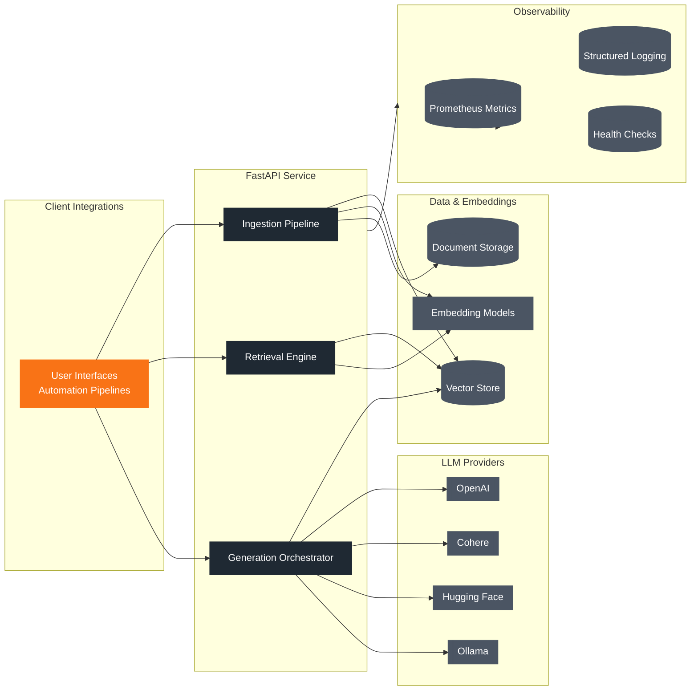

RAG Loom orchestrates document ingestion, embedding, search, and language generation within a modular FastAPI service. The following sections provide a conceptual map of the moving parts.

## High-Level Architecture

### Core Services

| Component | Responsibilities | Implementation Notes |
| --- | --- | --- |
| Ingestion Pipeline | Parse documents, chunk content, create embeddings | Supports PDF/text extraction, chunk size tuning, and metadata enrichment |
| Retrieval Engine | Perform vector similarity queries, assemble top-K matches | Pluggable vector store with adapters for ChromaDB, Qdrant, and Redis |
| Generation Orchestrator | Compose prompts, call the selected LLM, post-process responses | Abstraction over Ollama, OpenAI, Cohere, and Hugging Face |

### Storage & Compute

- **Vector store**: Choose from embedded (Chroma), managed (Qdrant Cloud), or self-hosted instances (Redis with vector extension).
- **Embeddings**: Default model is `sentence-transformers/all-MiniLM-L6-v2`; swap via configuration to match quality or localisation needs.
- **Document storage**: Persistent disk or object storage for source artefacts; optional remote backing.

### Observability

- **Metrics** exported via Prometheus-compatible endpoint.
- **Structured logs** aligned with deployment tooling (e.g., Loki, ELK).
- **Health checks** for FastAPI, vector store, and provider connectivity.

## Data Flow

1. **Ingest**: Documents are uploaded, chunked, embedded, and stored in the vector index.
2. **Retrieve**: A query triggers a vector similarity search; top results are marshalled with metadata.
3. **Generate**: Retrieved context plus the user query forms the prompt for the LLM provider.
4. **Respond**: The orchestrator collates model output and returns structured JSON to the client.

## Deployment Topology

For production environments, RAG Loom operates as part of a docker-compose stack:

- `rag-service`: FastAPI application with Gunicorn/Uvicorn workers.
- `qdrant` or `redis`: Vector storage.
- `ollama`: Optional local LLM runtime (if not using hosted providers).
- `prometheus` and `grafana`: Monitoring stack.

See [Production Deployment](../operations/deployment) for container topology details and operational guidance.

## Extensibility

- Implement new vector stores by conforming to the storage interface in `app/services`.
- Add providers (e.g., Azure OpenAI) by extending the LLM adapter set.
- Hook into FastAPI dependency injection to introduce custom authentication or rate limiting.

Ready to go deeper? Continue to [REST API](../api/rest-api) for endpoint specifics or [Production Deployment](../operations/deployment) to prepare for live environments.
